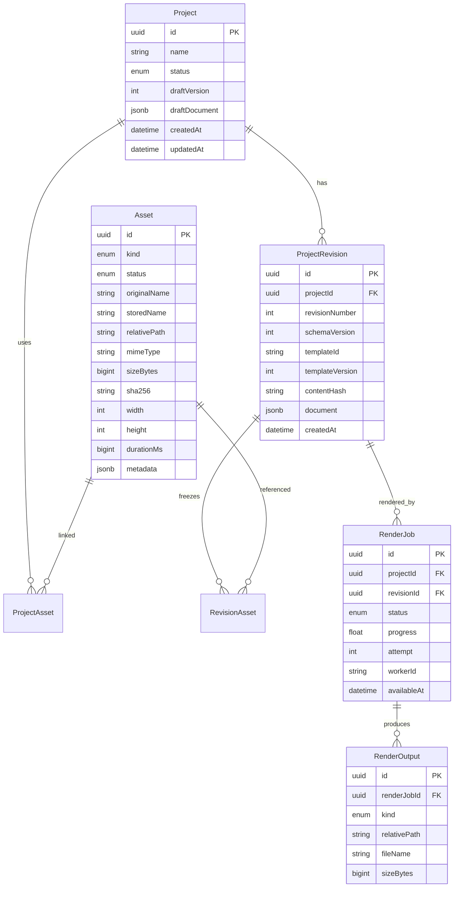

# 04 — Database Schema

## 1. Database choice

PostgreSQL 16 with Prisma.

Project content remains JSONB because scene contracts evolve faster than relational tables. Operational entities such as jobs, assets and outputs are relational.

## 2. Entity map



## 3. Table responsibilities

### Project

Stores the current mutable draft and optimistic concurrency version.

Important fields:

- `draftVersion`: incremented on every successful draft update.
- `draftDocument`: current validated ProjectDocument.
- `status`: `DRAFT` or `ARCHIVED`.

### ProjectRevision

Immutable render input.

Unique constraints:

- `(projectId, revisionNumber)`.
- `contentHash` is indexed but not globally unique.

### Asset

One physical file and its metadata.

A failed asset record is retained for diagnostics until cleanup.

### ProjectAsset

Tracks asset membership in the editable project.

This is denormalized from the JSON document when saving. It enables:

- Project asset listing.
- In-use checks.
- Cleanup.
- Future asset sharing.

### RevisionAsset

Freezes references used by an immutable revision.

A referenced physical asset cannot be deleted while a RevisionAsset exists.

### RenderJob

PostgreSQL-backed queue.

A job always references a ProjectRevision.

### RenderOutput

Metadata for final video, thumbnail and diagnostic log.

### WorkerHeartbeat

One row per worker process.

### AppSetting

Small runtime settings that do not require an application redeploy.

## 4. Draft update transaction

Input:

- Project ID.
- Expected draft version.
- New document.
- Extracted asset IDs.

Transaction:

1. Validate document before transaction.
2. Verify all asset IDs exist.
3. Update project only where `draftVersion = expectedVersion`.
4. Increment version.
5. Replace ProjectAsset rows.
6. Commit.
7. If no project row was updated, return `409 PROJECT_VERSION_CONFLICT`.

Pseudo SQL:

```sql
UPDATE "Project"
SET
  "draftDocument" = $document,
  "draftVersion" = "draftVersion" + 1,
  "updatedAt" = NOW()
WHERE id = $projectId
  AND "draftVersion" = $expectedVersion;
```

## 5. Revision and render transaction

1. Lock project row.
2. Validate draft.
3. Verify template and assets.
4. Compute next revision number.
5. Create revision.
6. Create RevisionAsset rows.
7. Create QUEUED RenderJob.
8. Commit.

This guarantees that a job cannot point to an incomplete revision.

## 6. Queue claim query

Prisma should use `$queryRaw` inside a transaction for this operation.

```sql
SELECT id
FROM "RenderJob"
WHERE status = 'QUEUED'
  AND "availableAt" <= NOW()
ORDER BY priority DESC, "createdAt" ASC
FOR UPDATE SKIP LOCKED
LIMIT 1;
```

Then:

```sql
UPDATE "RenderJob"
SET
  status = 'PREPARING',
  "workerId" = $workerId,
  attempt = attempt + 1,
  "startedAt" = COALESCE("startedAt", NOW()),
  "heartbeatAt" = NOW(),
  "updatedAt" = NOW()
WHERE id = $jobId;
```

## 7. Job state machine

```text
QUEUED
  → PREPARING
  → BUNDLING
  → RENDERING
  → ENCODING
  → COMPLETED

QUEUED/PREPARING/BUNDLING/RENDERING/ENCODING
  → CANCEL_REQUESTED
  → CANCELLED

PREPARING/BUNDLING/RENDERING/ENCODING
  → FAILED

FAILED
  → QUEUED  (explicit retry)
```

Invalid transitions must return a domain error and must not silently update the row.

## 8. Stale job recovery

At worker startup and periodically:

- Find active jobs with `heartbeatAt` older than `RENDER_STALE_AFTER_MINUTES`.
- If `attempt < maxAttempts`, reset to `QUEUED` and set `availableAt`.
- Otherwise mark `FAILED` with `WORKER_LOST`.
- Remove temporary output associated with the abandoned attempt.

## 9. Deletion rules

### Project archive

Soft state change only.

### Asset delete

Allowed only when:

- No ProjectAsset reference.
- No RevisionAsset reference.
- No active render uses it.

Otherwise return `409 ASSET_IN_USE`.

### Render output delete

Deletes physical output and RenderOutput row. RenderJob and ProjectRevision remain.

### Project hard deletion

Not exposed in MVP UI.

A maintenance command may hard delete an archived project only after explicit confirmation and reference analysis.

## 10. Indexes

Required:

- Project `(status, updatedAt DESC)`.
- ProjectRevision `(projectId, revisionNumber DESC)`.
- ProjectRevision `(contentHash)`.
- Asset `(status, createdAt DESC)`.
- Asset `(sha256)`.
- ProjectAsset `(projectId)`.
- RevisionAsset `(revisionId)`.
- RenderJob `(status, availableAt, priority, createdAt)`.
- RenderJob `(projectId, createdAt DESC)`.
- RenderOutput `(renderJobId)`.
- WorkerHeartbeat `(lastSeenAt)`.

## 11. Machine-readable schema

See `schemas/prisma/schema.prisma`.
